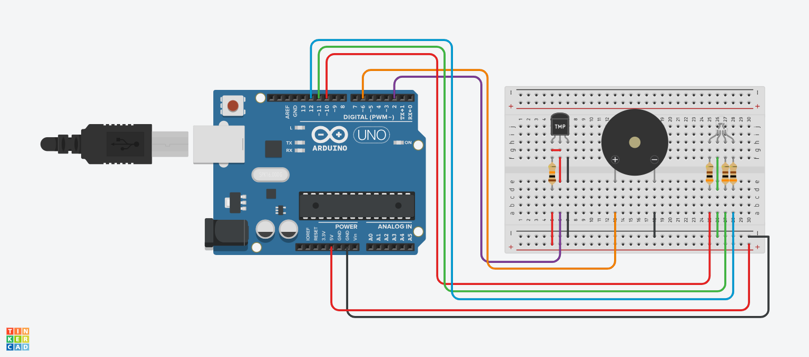
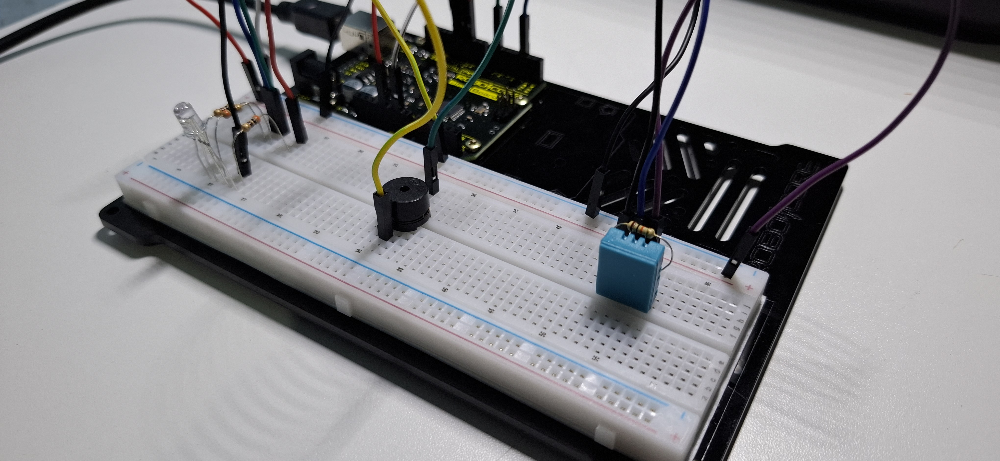

# Alarme-de-Temperatura-e-Umidade
Alarme de Temperatura e Umidade com Arduino.

Este projeto consiste na prototipagem de um sistema de controle de temperatura e umidade. O projeto foi desenvolvido com o uso do sensor DHT11 responsável por realizar as medições de temperatura e umidade do ambiente, além de um buzzer e um LED RGB responsáveis pela emissão de alertas.

  
 

Em determinadas condições de temperatura e umidade, por meio de sinais sonoros e luminosos, o sistema pode comunicar ao usuário a situação real do ambiente, seja ela branda, alarmante ou crítica. O projeto pode ser futuramente aprimorado com o uso de um display LCD, além de outros componentes que podem extender a aplicabilidade do sistema.

---
## Componentes utilizados
  - Arduino Uno (1x)
  - Sensor de Temperatura e Umidade DHT11 (1x)
  - Buzzer Passivo 5 V (1x)
  - LED RGB 5 mm (1x)
  - Resistor 10 kΩ (1x)
  - Resistor 300 Ω (3x)
  - Protoboard (1x)
  - Jumpers

---
## Esquemático do Circuito

  

 

**Legenda:**
  - 5 V -> Sensor TMP (Sensor DHT11)
  - D2 -> Linha de Sinal do Sensor TMP (Sensor DHT11)
  - D6 -> Buzzer (+)
  - D10 -> LED Red
  - D11 -> LED Green
  - D12 -> LED Blue
  - Resistores: 300 Ω e 10 kΩ

---
## Montagem e Funcionamento

  

 

🎥 **Vídeo do Funcionamento:**  
👉 [Acesse clicando aqui!](https://youtu.be/SsBZ)

---
## Código do Projeto
Quer ver como esse projeto foi programado?  
👉 [Acesse o código clicando aqui!](alarme-de-temperatura-e-umidade/alarme-de-temperatura-e-umidade.ino)
